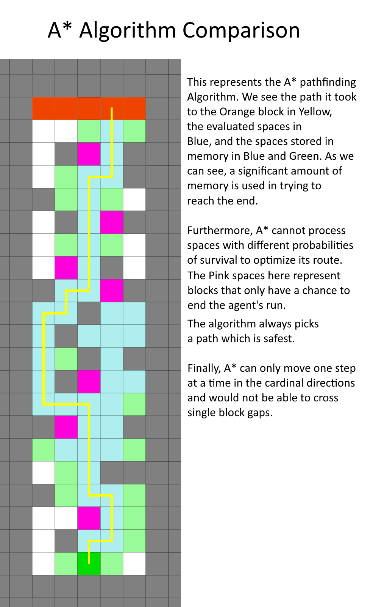
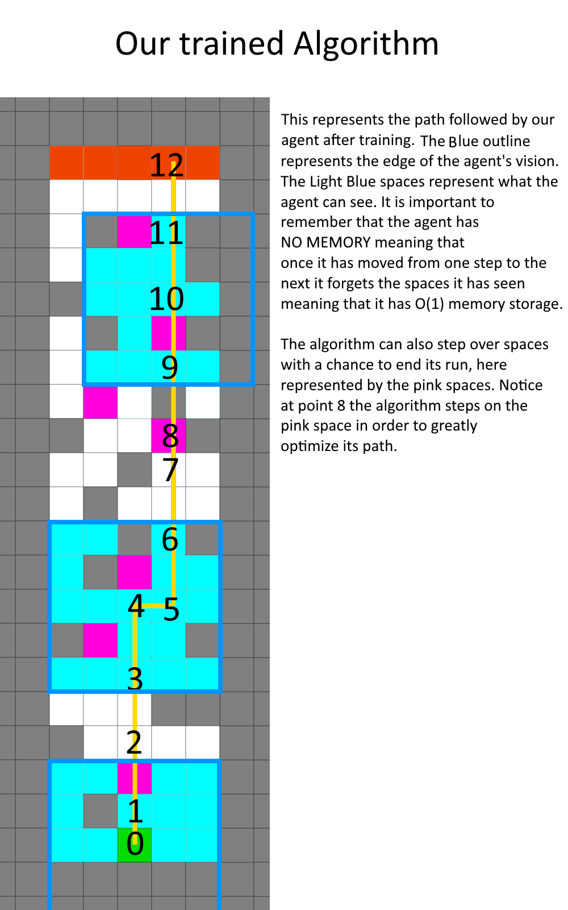
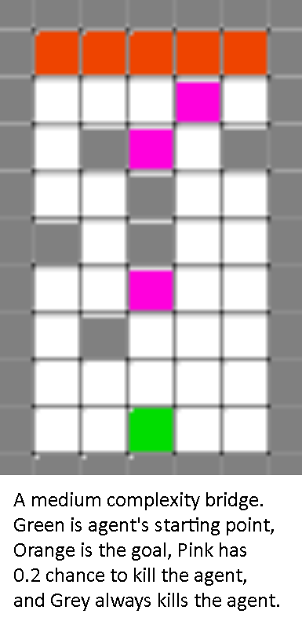
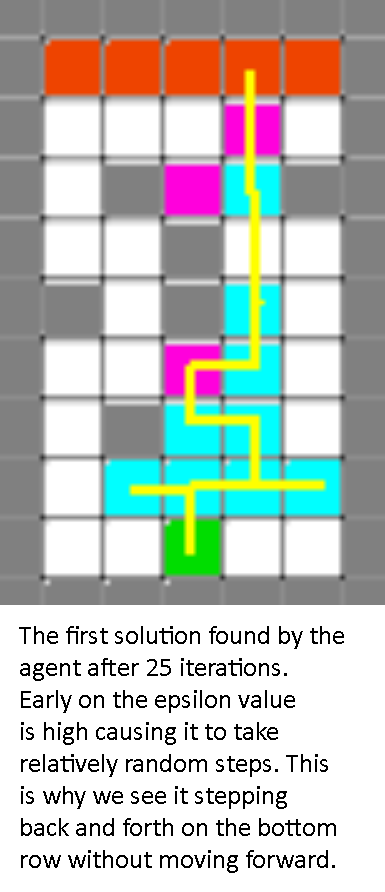
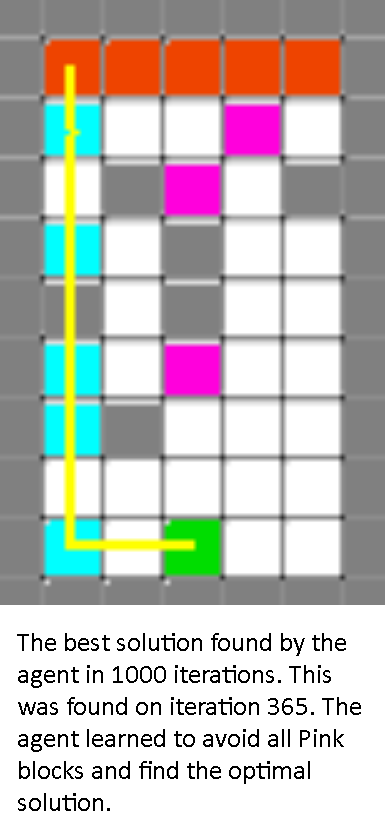
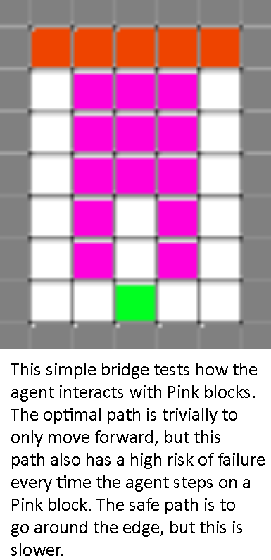
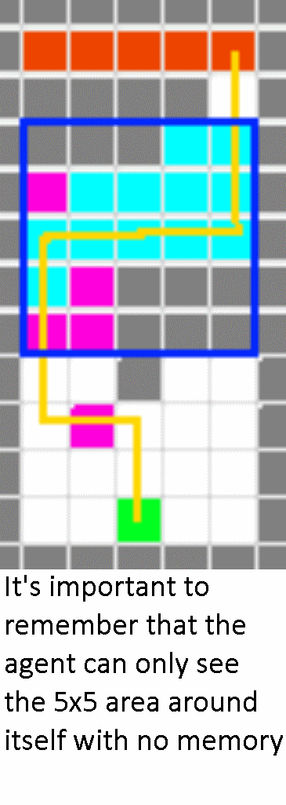

## Video
<iframe width="560" height="315" src="https://www.youtube.com/embed/X4DgzqaTSnk?rel=0" frameborder="0" allow="accelerometer; autoplay; encrypted-media; gyroscope; picture-in-picture" allowfullscreen></iframe>

## Project Summary

| | |
| - | - |
|||

The agent will attempt to navigate towards a known goal in a 2D platforming environment. The environment will have three main types of blocks: air, redstone, and stone. It can walk normally on a stone block, and will die if it walks into an air block. The redstone block has an interesting effect where the agent has a low chance of dying if it walks on a redstone block.  
The agent will be “nearsighted” and take in a 5x5 grid of our immediate surroundings as its input. It will then try to predict the best course of action from the following set of actions: step up, step left, step right, jump up, jump left, and jump right. For every action it takes it will get a reward based on whether it made it to the goal, its distance to the goal, and number of steps it has taken. 
This is not a trivial problem because the agent is not only nearsighted, but it is also completely memoryless. A memoryless system allows us to save tons of space, and this adds up. Space is a major constraint with large scale applications that require machine learning or deep learning solutions. Any solution that doesn't need space is more optimal than a faster solution that needs extra space. We are trying to find a constant space search algorithm, and that scales far better than a faster algorithm that doesn’t use constant space. 

## Approaches

We decided to take the following two approaches to this problem: evolutionary learning with a genetic algorithm, and policy gradient reinforcement learning. 
The first approach is evolutionary learning, where the A.I. currently trains with a genetic algorithm to run several neural networks against the maze. It then chooses the top x networks sorted on a reward function for the next generation. The program sorts on the following parameters with descending priority: whether it reached the goal, its distance to the goal, and the total number of steps it has taken for the current run. Then it performs mutations on each one to add randomness and to avoid falling into local minima. It repeats this cycle for a 1000 iterations so that even if it were to find a solution in that time, it would also potentially be able to look for more optimal solutions.

The second approach is reinforcement learning using policy gradients. Policy gradients allow us to train an agent by taking small steps and updating the policy function below based on the reward returned from that step. These rewards can be either sent immediately to the agent or sent at the end of an episode (attempt at solving the maze). 

For this project, we applied Monte-Carlo Policy Gradient, which means that we run through an episode, grab all rewards for each step, and update our policy based on those rewards.

The action value function above represents the expected return given a certain state-action pair. That function is used in the discounted reward vector function below to calculate the total reward over an episode.

The reward vector is then factored into the loss function, and we take the loss function’s gradient (can be seen below) to take small steps towards the “goal.”

In our application, the goal is for the agent to be able to make the correct decision based on its 5x5 views it gets every move it makes in an episode. Eventually, the agent should be able to understand its inputs and rewards to solve any given 2D maze. 

Additionally, in order to speed up training time and test the efficacy of our approach, we created a discrete simulation of the Minecraft world the agent will be operating in. In our simulation, the world is a 2D vector of 1s and 0s, and our simulation allows us to grab a vector that represents the 5x5 state that the agent sees. This simulation allows us to manually perform any action from our action set. It also updates the world based on what action we forced the agent to do. It will also allow us to manually reset the world but it also automatically resets after the agent “dies.”

## Evaluation

We evaluated our agent on the same simulator discussed in the status report in order to gain more data more quickly. Below are some levels we designed to test various capabilities of the agent.

| | | |
| - | - | - |
||||

As we see in this medium difficulty level, the agent first seeks out any possible path it can take to the end, then optimizes its route.

| | | |
| - | - | - |
||||

In the case of a simple but unsafe environment, we could control if the agent sought speed or safety based on how we modified the agent’s reward function.
We defined a difficult or complicated map to require the agent to move both left and right at different points. The map below was first solved on iteration 849 out of 1000:

These results confirm that the agent does successfully learn its environment and can show a preference in terms of seeking safe vs fast paths depending on hyperparameters.

Comparing our results to the evolutionary algorithm method employed in the status report, we can see that the new agent can solve simpler bridges more quickly but struggles with more complex bridges.

## References

We used NumPy, PyTorch, Matplotlib, and Malmo documentation to help build our prototype. We also referenced the following article to understand how to implement policy learning with PyTorch: https://medium.com/@ts1829/policy-gradient-reinforcement-learning-in-pytorch-df1383ea0baf/ 
