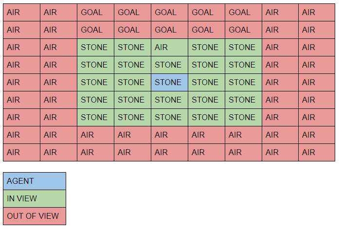
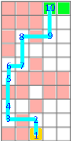

<iframe width="560" height="315" src="https://www.youtube.com/embed/cmZiq2iNe1g" frameborder="0" allow="accelerometer; autoplay; encrypted-media; gyroscope; picture-in-picture" allowfullscreen></iframe>

Project Summary:
The agent is will attempt to navigate towards a known goal in a 2D platforming environment. The agent will be “nearsighted” and take in a 5x5 grid of our immediate surroundings as its input. It will then try to predict the best course of action from the following set of actions: walk one space up, down, left, or right; or jump two spaces up, down, left, or right. For every action it takes it will get a reward based on whether it made it to the goal, its distance to the goal, and number of steps it has taken. 

Approach:
The A.I. currently trains with a genetic algorithm that uses evolutionary learning to run several neural networks against the maze. It then chooses the top x networks sorted on a reward function  for the next generation. The program sorts on the following parameters with descending priority: whether it reached the goal, its distance to the goal, and total number of steps it has taken for the current run. Then it performs mutations on each one to add randomness and to avoid falling into local minima. It repeats this cycle for a 1000 iterations so that even if it were to find a solution in that time, it would also potentially be able to look for more optimal solutions. 
In order to speed up training time and test the efficacy of our approach, we created a discrete simulation of the Minecraft world the agent will be operating in. In our simulation, the world is a 2D vector of 1s and 0s, and our simulation allows us to grab a vector that represents the 5x5 state that the agent sees. This simulation allows us to manually perform any action from our action set. It also updates the world based on what action we forced the agent to do. It will also allow us to manually reset the world but it also automatically resets after the agent “dies.” 

Evaluation:
	Because Malmo can run quite slowly at times, we evaluated our prototype on the simulated environment described above. We used python data structures to store the level data and created an interface to control the agent which matched the malmo implementation. This environment allowed us to quickly evaluate the agent on much more complex levels. To confirm that the agent is learning, we tracked the best agent each generation and plotted it’s fitness function over the generations. The image below shows the level the agent was tasked with completing along with the route the final agent decided to take. The graph below shows the stats of the best agent at each generation:

The orange line represents the steps taken before the agent either dies or reaches the end. This line increases for its majority because every time a generation discovers a new technique, it is able to avoid death for longer. Once the agent has reached the goal, it then prioritizes finding faster solutions, hence the drop in the orange line near the end of training. The blue line represents the distance to the goal which is strictly decreasing.
	As for evaluation in malmo itself, there appear to still be bugs and inconsistencies in how we control the agent in malmo meaning that even the simple level described in the summary has trouble being learned. When we used the same level in the simulation, our agent could consistently find the optimal solution (two forward jumps) and apply it in every future generation. THis indicates that more work must be done before our malmo implementation is ready.

Remaining Goals and Challenges:
	Our prototype has some success in a discrete environment, but the final agent needs to be able to operate in a continuous environment. 

Continuous vs discrete (zombies and random event platforms)
Tripwires
Level generation
Using a policy learning function and comparing it against our evolutionary learning algorithm
Moving platforms 
MALMO IS A PEACE OF SHIT

Resources Used:
We used NumPy, PyTorch, Matplotlib, and Malmo documentation to help build our prototype. 

